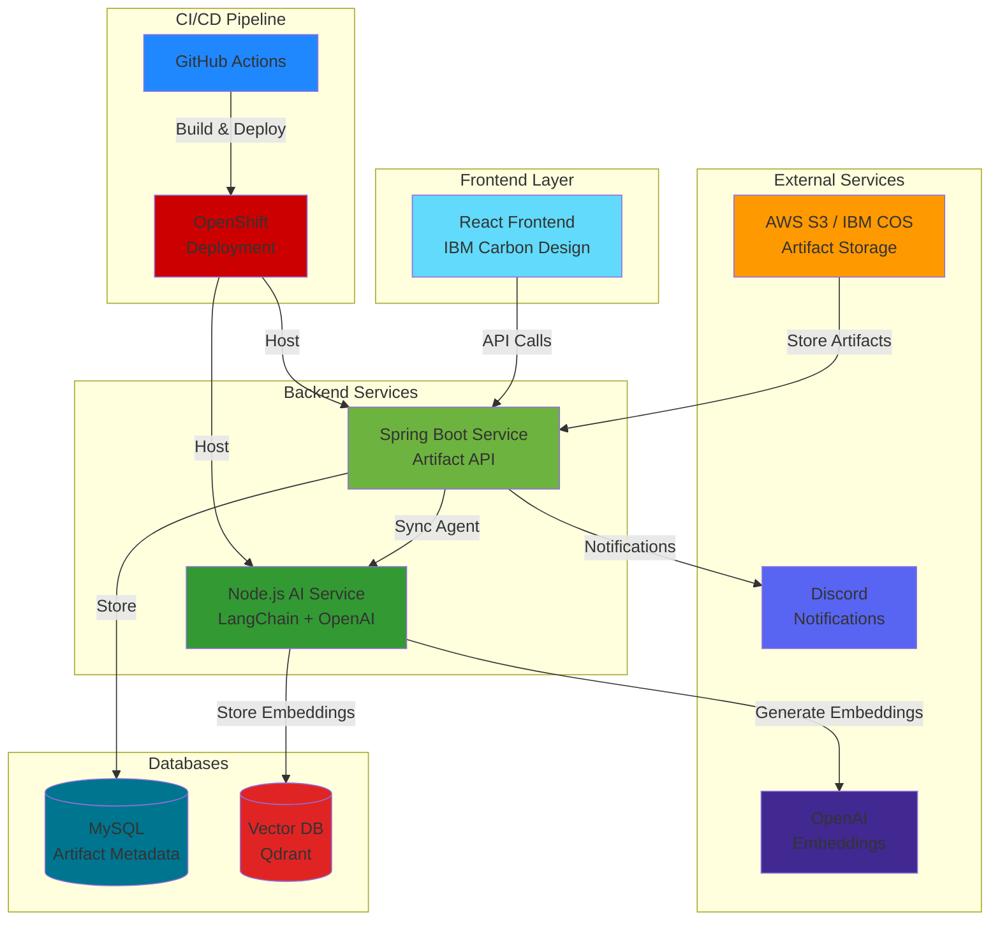
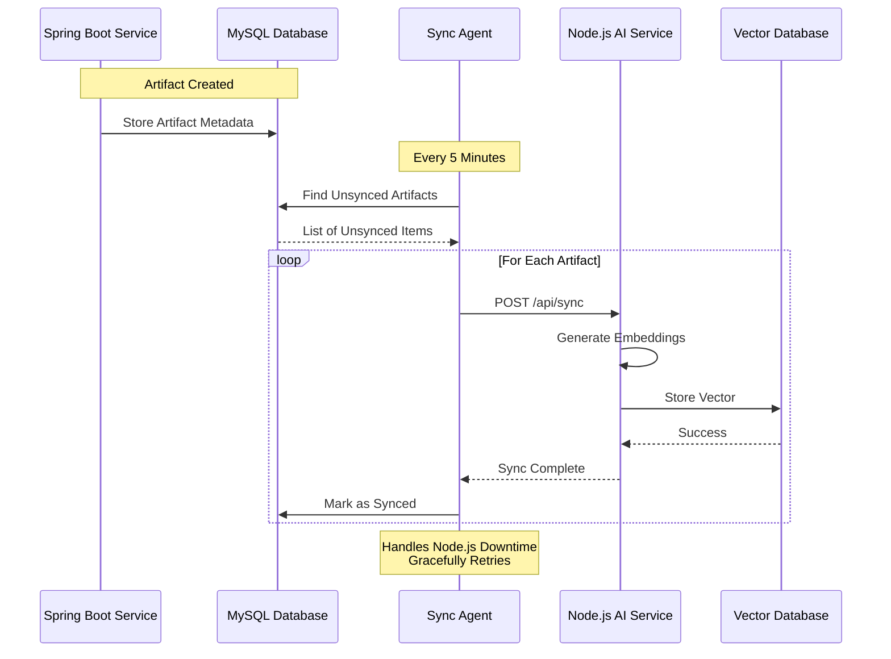
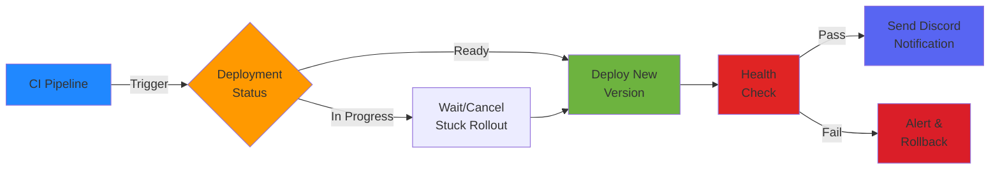

# IBM Artifact Management Platform

> A cloud-native platform for managing and analyzing software artifacts, designed to compare Spring Boot and Quarkus performance on IBM's OpenShift infrastructure. This project leverages IBM technologies to deliver AI-driven insights and modern DevOps practices.

## 🚀 Live Demo
- **Dashboard**: [https://ibm-artifact-management-platform.vercel.app](https://ibm-artifact-management-platform.vercel.app) ✅ Live
- **Spring Boot Service**: [https://spring-boot-route-sagarregmi2056-dev.apps.rm1.0a51.p1.openshiftapps.com/api/v1/artifacts](https://spring-boot-route-sagarregmi2056-dev.apps.rm1.0a51.p1.openshiftapps.com/api/v1/artifacts) ✅ Live
- **AI Service**: [https://nodejs-ai-service-sagarregmi2056-dev.apps.rm1.0a51.p1.openshiftapps.com](https://nodejs-ai-service-sagarregmi2056-dev.apps.rm1.0a51.p1.openshiftapps.com) ✅ Live
- **Quarkus Service**: 🚧 Coming Soon

## 🏗️ System Architecture

### High-Level Architecture



### Component Flow

1. **Data Ingestion**
   - CI/CD pipelines register artifacts via API
   - Spring Boot stores artifact metadata in MySQL
   - MySQL tracks repository, commit, branch, build info

2. **Sync Mechanism** (Resilient Design)
   - Background sync agent (every 5 minutes)
   - Marks artifacts as synced only after successful vector DB update
   - Handles Node.js service downtime gracefully
   - Retries failed syncs automatically

3. **AI Search**
   - Semantic search via Node.js AI service
   - LangChain + OpenAI for embeddings
   - Vector similarity search for results

4. **Frontend Dashboard**
   - React + IBM Carbon Design
   - Real-time artifact tracking
   - Deployment history visualization
   - AI-powered search interface

## 🎯 Key Features

### ✅ Implemented Features
- **AI-Powered Semantic Search**: Natural language artifact discovery
- **CI/CD Integration**: Automatic artifact registration from pipelines
- **Version History Tracking**: Full deployment lineage per repository
- **Real-time Monitoring**: Custom metrics & health checks (Prometheus-compatible)
- **Discord Notifications**: Deployment alerts via Discord webhooks
- **Auto-Sync Mechanism**: Resilient sync between MySQL and Vector DB
- **Build Status Tracking**: SUCCESS/FAILED pipeline monitoring
- **Repository Analytics**: Track deployments per repo/branch/commit

### 🔄 Sync Mechanism (Problem Solved)

**The Challenge:**
- When Node.js AI service is down, artifacts were marked as synced but never indexed in Vector DB
- Using RabbitMQ would require additional pods (resource-intensive in OpenShift sandbox)

**Our Solution:**
Implemented a resilient sync mechanism that:
- ✅ Runs scheduled sync every 5 minutes
- ✅ Marks artifacts as synced ONLY after successful Vector DB update
- ✅ Automatically retries failed syncs
- ✅ Gracefully handles service downtime
- ✅ Tracks sync status with timestamps
- ✅ Zero additional infrastructure required

**How It Works:**


### 📊 Monitoring & CI/CD

**Problem in OpenShift Sandbox:**
- Grafana and Prometheus unavailable
- Need for deployment monitoring and CI/CD alerts

**Our Solution:**
- ✅ Custom metrics endpoints (`/actuator/prometheus`)
- ✅ Health check endpoints (`/actuator/health`)
- ✅ Discord webhook integration for deployment notifications
- ✅ Automated build status tracking
- ✅ Deployment pipeline visibility

### 🚀 Zero-Downtime CI/CD Implementation

**Problem Solved:**
- Traditional deployments cause service interruptions
- Manual rollbacks are time-consuming and error-prone
- Unsynchronized database migrations can break deployments

**Our Implementation:**
Implemented a complete CI/CD pipeline with zero-downtime deployments for Spring Boot, MySQL, and Node.js services:

1. **Automated CI Pipeline** (`.github/workflows/ci.yml`)
   - Builds Maven project
   - Runs automated tests
   - Builds and pushes Docker images to registry
   - Tags images with commit SHA for traceability

2. **Zero-Downtime CD Pipeline** (`.github/workflows/cd.yml`)
   - Automatically triggered after successful CI
   - Checks for in-progress deployments (prevents conflicts)
   - Cancels stuck deployments gracefully
   - Waits for rollout completion before health checks
   - Sends deployment notifications to Discord

3. **Database Migration Strategy** (Flyway)
   - Version-controlled schema changes
   - Automatic migration on deployment
   - Rollback-safe migrations
   - Separate migration jobs prevent deployment conflicts

**Deployment Flow:**


### 🏢 IBM Ecosystem Alignment

**Motivation:**
This project was inspired by IBM's requirements for enterprise artifact management. The unmanaged and improper way of tracking artifacts can lead to:
- ❌ **Time Waste**: Hours spent finding correct artifact versions
- ❌ **Cost Overruns**: Deploying wrong versions causes downtime
- ❌ **Security Risks**: Outdated dependencies and vulnerability exposure
- ❌ **Compliance Issues**: Inability to track what was deployed and when

**Our Solution Mimics IBM Ecosystem:**
- ✅ **Centralized Artifact Repository**: Single source of truth
- ✅ **Automated Tracking**: CI/CD integration eliminates manual errors
- ✅ **AI-Powered Discovery**: Natural language search for quick artifact location
- ✅ **Version Lineage**: Complete history with commit, branch, and build info
- ✅ **Compliance Ready**: Audit trail for every deployment
- ✅ **Cost Optimization**: Prevent duplicate artifacts and reduce storage costs

**Enterprise Features:**
- Automated database migrations (Flyway)
- Health checks and monitoring endpoints
- Discord webhooks for deployment notifications
- Zero-downtime deployments
- CI/CD pipeline automation
- Vector database integration for AI search

## 🛠️ Tech Stack

### Backend Services
- **Spring Boot 3.2**: Main artifact service + MySQL persistence
- **Java 19**: Language runtime
- **MySQL**: Primary database for artifact metadata
- **Flyway**: Database migrations

### AI Services  
- **Node.js**: AI service runtime
- **LangChain**: AI orchestration framework
- **OpenAI**: Embedding generation
- **Qdrant Vector DB**: Semantic search storage

### Frontend
- **React 18**: UI framework
- **IBM Carbon Design**: Component library
- **React Query**: Data fetching & caching
- **React Router**: Navigation
- **Vite**: Build tool

### Infrastructure
- **OpenShift**: Container orchestration
- **Tekton**: CI/CD pipelines
- **Docker**: Containerization
- **Vercel**: Frontend hosting

### Integration & Tools
- **GitHub Actions**: CI/CD automation
- **Discord API**: Deployment notifications
- **AWS S3 / IBM COS**: Artifact storage
- **Axios**: HTTP client

## 📖 Quick Start

### Prerequisites
- OpenShift cluster access
- Node.js 20+
- Java 19+
- MySQL 8+
- Docker

### Local Development
```bash
# 1. Start MySQL (via Docker Compose)
cd spring-boot-service
docker-compose up -d

# 2. Start Spring Boot Service
cd spring-boot-service
mvn spring-boot:run

# 3. Start Node.js AI Service
cd nodejs-service
npm install
npm start

# 4. Start Frontend
cd frontend-service
npm install
npm run dev
```

### Deploy to OpenShift
```bash
# Apply Kubernetes manifests
oc apply -f openshift/spring-boot-deployment.yaml
oc apply -f openshift/mysql-deployment.yaml
oc apply -f openshift/nodejs-deployment.yaml
```


## 🔗 Links

- Dashboard: [ibm-artifact-management-platform.vercel.app](https://ibm-artifact-management-platform.vercel.app)
- API Health: [spring-boot-route.../actuator/health](https://spring-boot-route-sagarregmi2056-dev.apps.rm1.0a51.p1.openshiftapps.com/actuator/health)
- API Metrics: [spring-boot-route.../actuator/prometheus](https://spring-boot-route-sagarregmi2056-dev.apps.rm1.0a51.p1.openshiftapps.com/actuator/prometheus)

## 🎬 Demo Video
🚧 Coming Soon


