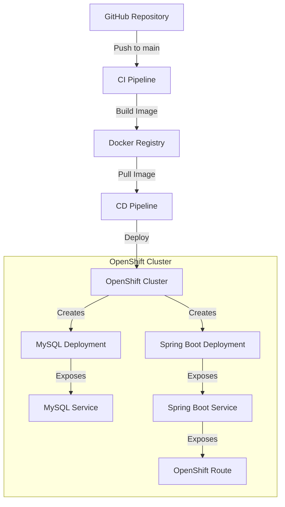
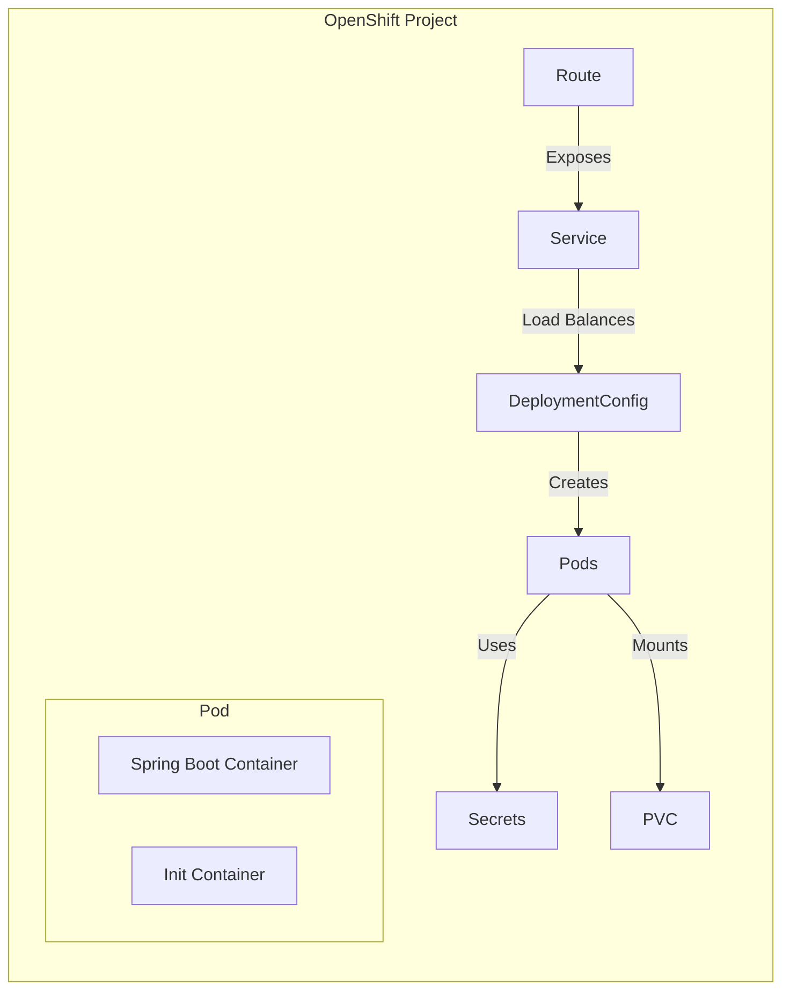
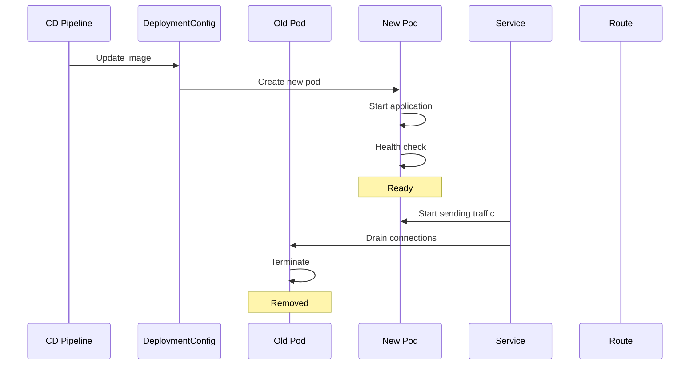
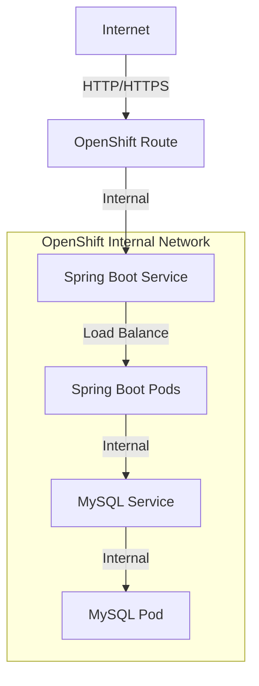
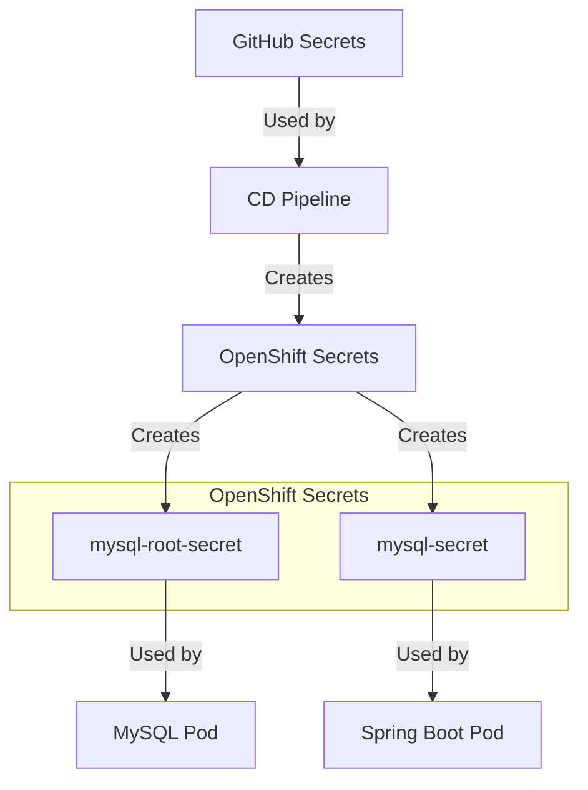

# OpenShift Deployment Pipeline

This document explains the Continuous Deployment (CD) pipeline that deploys our Spring Boot application to OpenShift.

## Architecture Overview

### 1. Overall CI/CD Flow


### 2. Deployment Components


### 3. Zero-Downtime Deployment Process


### 4. Network Architecture


### 5. Secret Management


## Deployment Components

### 1. MySQL Database
- **Deployment**: `mysql-deployment.yaml`
- **Service**: Internal service on port 3306
- **PVC**: Persistent volume for data storage
- **Secrets**:
  - `mysql-root-secret`: Root password
  - `mysql-secret`: Application database credentials

### 2. Spring Boot Application
- **Deployment**: `spring-boot-deployment.yaml`
- **Service**: Internal service on port 8081
- **Route**: External access via HTTP
- **Environment**: Configured via secrets

## Pipeline Steps

### 1. Initial Setup
```bash
# Install OpenShift CLI
curl -L https://mirror.openshift.com/pub/openshift-v4/clients/oc/latest/linux/oc.tar.gz -o oc.tar.gz
tar -xzf oc.tar.gz
sudo mv oc /usr/local/bin/

# Login to OpenShift
oc login --token=$TOKEN --server=$SERVER
```

### 2. Create Secrets
```bash
# MySQL Root Secret
oc create secret generic mysql-root-secret \
  --from-literal=MYSQL_ROOT_PASSWORD=*** \
  --from-literal=MYSQL_DATABASE=spring_artifacts

# Application Secret
oc create secret generic mysql-secret \
  --from-literal=SPRING_DATASOURCE_URL=jdbc:mysql://mysql:3306/spring_artifacts \
  --from-literal=SPRING_DATASOURCE_USERNAME=*** \
  --from-literal=SPRING_DATASOURCE_PASSWORD=*** \
  --from-literal=SERVER_PORT=8081
```

### 3. Deploy MySQL
```bash
# Create PVC
oc apply -f mysql/mysql-pvc.yaml

# Deploy MySQL
oc apply -f mysql/mysql-deployment.yaml
oc apply -f mysql/mysql-service.yaml

# Wait for MySQL
oc rollout status dc/mysql --timeout=300s
```

### 4. Deploy Spring Boot
```bash
# Create Service & Route
oc apply -f spring-boot-service.yaml
oc apply -f spring-boot-route.yaml

# Deploy Application
oc apply -f spring-boot-deployment.yaml
```

### 5. Verify Deployment
```bash
# Check pod status
oc get pods -l app=spring-boot-app

# Check route
oc get route spring-boot-route

# Test health endpoint
curl http://<route-url>/actuator/health
```

## Rollout Process

When new code is pushed:

1. **CI Pipeline**:
   - Builds new Docker image
   - Tags with commit SHA
   - Pushes to registry

2. **CD Pipeline**:
   - Pulls new image
   - Updates deployment config
   - Triggers rollout

3. **Zero-Downtime Deployment**:
   ```bash
   # Update image
   oc set image dc/spring-boot-app spring-boot-app=new-image:tag
   
   # Trigger rollout
   oc rollout latest dc/spring-boot-app
   
   # Monitor rollout
   oc rollout status dc/spring-boot-app
   ```

## Monitoring Commands

### Pod Status
```bash
# Get pods
oc get pods

# Pod logs
oc logs <pod-name>

# Pod description
oc describe pod <pod-name>
```

### Resource Usage
```bash
# CPU/Memory usage
oc adm top pod

# Pod metrics
oc exec <pod-name> -- curl localhost:8081/actuator/metrics
```

### Route Information
```bash
# Get route
oc get route spring-boot-route

# Route details
oc describe route spring-boot-route
```

## Troubleshooting

### Common Issues

1. **Image Pull Errors**:
   ```bash
   oc describe pod <pod-name> | grep -A 5 "Events:"
   ```

2. **Database Connection**:
   ```bash
   # Test MySQL connection
   oc exec <pod-name> -- curl mysql:3306
   ```

3. **Health Check Failures**:
   ```bash
   # Check health endpoint
   oc exec <pod-name> -- curl localhost:8081/actuator/health
   ```

### Debug Commands

```bash
# Get recent events
oc get events --sort-by='.lastTimestamp'

# Check logs
oc logs -f dc/spring-boot-app

# Check environment variables
oc set env pod/<pod-name> --list
```

## Environment Variables

Key environment variables used in deployment:

| Variable | Purpose | Source |
|----------|---------|--------|
| SPRING_DATASOURCE_URL | Database connection | mysql-secret |
| SPRING_DATASOURCE_USERNAME | Database user | mysql-secret |
| SPRING_DATASOURCE_PASSWORD | Database password | mysql-secret |
| SERVER_PORT | Application port | mysql-secret |
| MYSQL_ROOT_PASSWORD | MySQL root password | mysql-root-secret |

## Security Notes

1. All sensitive data stored in secrets
2. Internal services not exposed externally
3. Database accessible only within cluster
4. Health endpoints exposed via /actuator
5. Route configured for HTTP/HTTPS based on TLS

## Maintenance

### Scaling
```bash
# Scale deployment
oc scale dc/spring-boot-app --replicas=3
```

### Updates
```bash
# Update resources
oc set resources dc/spring-boot-app --limits=cpu=500m,memory=1Gi

# Update environment variables
oc set env dc/spring-boot-app KEY=VALUE
```

### Rollback
```bash
# Rollback to previous version
oc rollback dc/spring-boot-app
```
