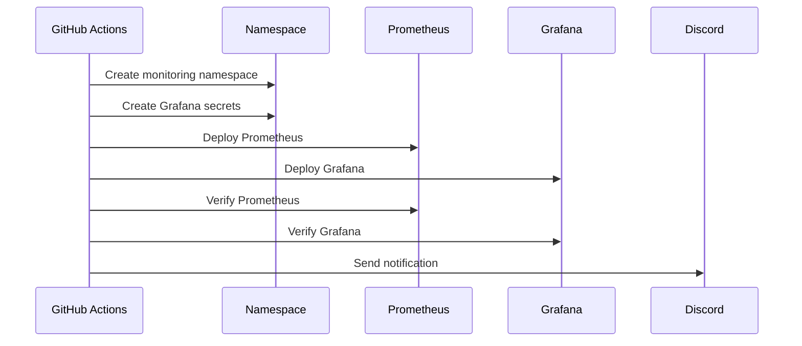
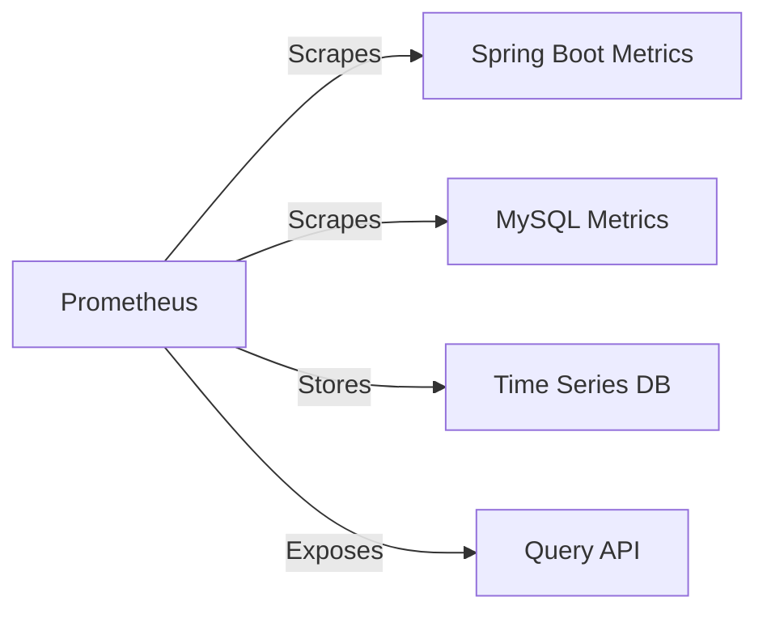
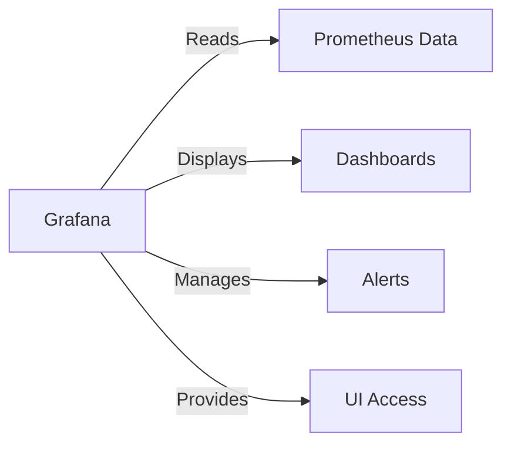

# Monitoring Stack Setup

This guide explains how to set up and manage the monitoring stack (Prometheus & Grafana) for our OpenShift deployment.

## Architecture Overview

```mermaid
graph TD
    subgraph GitHub Actions
        A[monitor.yml] -->|Triggers After| B[CD Pipeline Success]
        B -->|Deploys| C[Monitoring Stack]
    end
    
    subgraph OpenShift Monitoring Namespace
        C -->|Creates| D[Prometheus]
        C -->|Creates| E[Grafana]
        D -->|Provides Data| E
    end
    
    subgraph Metrics Flow
        F[Spring Boot App] -->|Exposes| G[/actuator/prometheus]
        H[MySQL] -->|Exposes| I[MySQL Metrics]
        G -->|Scraped by| D
        I -->|Scraped by| D
    end
```

## Prerequisites

1. **GitHub Secrets Setup**:
   ```bash
   # Add these secrets to your GitHub repository
   OPENSHIFT_SERVER_URL=<your-openshift-server>
   OPENSHIFT_TOKEN=<your-openshift-token>
   OPENSHIFT_PROJECT=<your-project-name>
   GRAFANA_ADMIN_PASSWORD=<your-grafana-password>  # Choose a strong password
   ```

2. **Required Files Structure**:
   ```plaintext
   openshift/
   ├── monitoring/
   │   ├── prometheus/
   │   │   ├── prometheus-configmap.yaml   # Prometheus configuration
   │   │   └── prometheus-deployment.yaml  # Prometheus deployment
   │   ├── grafana/
   │   │   ├── grafana-deployment.yaml    # Grafana deployment
   │   │   ├── datasources-configmap.yaml # Prometheus datasource
   │   │   ├── dashboards-configmap.yaml  # Dashboard provider
   │   │   └── dashboards/               # Pre-configured dashboards
   │   │       ├── spring-boot.json      # Spring Boot metrics
   │   │       └── mysql.json            # MySQL metrics
   │   └── README.md                     # Setup instructions
   └── ...
   ```

## Workflow Explanation

### 1. Trigger Condition
```yaml
on:
  workflow_run:
    workflows: ["Spring Boot CD to OpenShift"]
    types:
      - completed
    branches:
      - main
```
- Runs after CD pipeline succeeds
- Only triggers on main branch

### 2. Deployment Flow


### 3. Monitoring Components

#### Prometheus


#### Grafana


## Setup Instructions

1. **Add GitHub Secrets**:
   - Go to Repository Settings
   - Navigate to Secrets and Variables → Actions
   - Add New Repository Secret:
     ```plaintext
     Name: GRAFANA_ADMIN_PASSWORD
     Value: <your-chosen-password>
     ```

2. **Verify Workflow**:
   ```bash
   # Check if monitor.yml is in place
   .github/workflows/monitor.yml

   # Ensure monitoring files exist
   openshift/monitoring/
   ```

3. **Deploy Manually (if needed)**:
   ```bash
   # Switch to monitoring namespace
   oc new-project monitoring

   # Deploy monitoring stack
   oc apply -f openshift/monitoring/prometheus/
   oc apply -f openshift/monitoring/grafana/
   ```

## Access Information

### Prometheus
- URL: `http://<prometheus-route>`
- Port: 9090
- Features:
  - Query Interface
  - Target Status
  - Alert Rules

### Grafana
- URL: `http://<grafana-route>`
- Port: 3000
- Default Login:
  ```
  Username: admin
  Password: <GRAFANA_ADMIN_PASSWORD>
  ```
- Available Dashboards:
  1. Spring Boot Metrics
     - HTTP Request Rate
     - JVM Memory Usage
     - Database Connections
  2. MySQL Metrics
     - Connected Threads
     - InnoDB I/O
     - Buffer Pool Usage

## Troubleshooting

### Common Issues

1. **Prometheus Can't Scrape Metrics**:
   ```bash
   # Check target status
   oc exec <prometheus-pod> -- curl localhost:9090/api/v1/targets
   ```

2. **Grafana Can't Connect to Prometheus**:
   ```bash
   # Verify Prometheus service
   oc get svc prometheus
   ```

3. **Dashboard Not Loading**:
   ```bash
   # Check Grafana logs
   oc logs <grafana-pod>
   ```

### Debug Commands
```bash
# Check pod status
oc get pods -n monitoring

# Check routes
oc get routes -n monitoring

# View Prometheus config
oc get configmap prometheus-config -o yaml

# View Grafana datasources
oc get configmap grafana-datasources -o yaml
```

## Maintenance

### Updating Passwords
```bash
# Update GitHub Secret
1. Go to GitHub Repository Settings
2. Update GRAFANA_ADMIN_PASSWORD

# Manual update if needed
oc create secret generic grafana-secrets \
  --from-literal=admin-user=admin \
  --from-literal=admin-password=<new-password> \
  -n monitoring --dry-run=client -o yaml | oc replace -f -
```

### Backup
```bash
# Backup Grafana dashboards
oc exec <grafana-pod> -- curl -X GET http://localhost:3000/api/dashboards/uid/<dashboard-uid>

# Backup Prometheus rules
oc get configmap prometheus-config -o yaml > prometheus-backup.yaml
```

### Scaling
```bash
# Scale Prometheus
oc scale deployment prometheus --replicas=2

# Scale Grafana
oc scale deployment grafana --replicas=2
```
