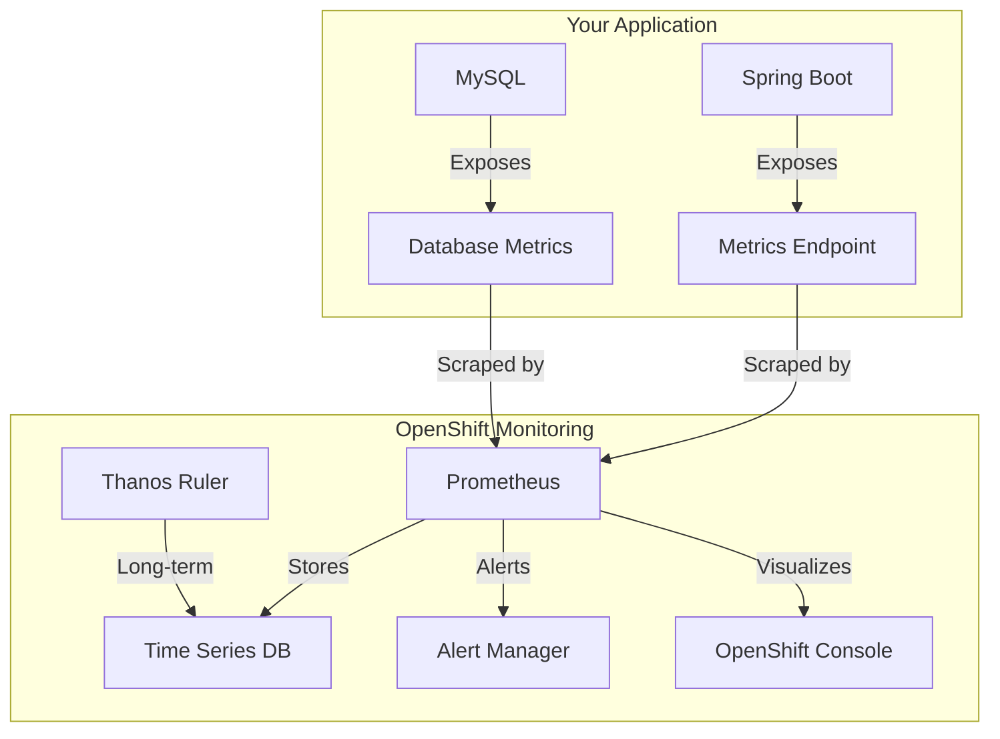

# Detailed Monitoring Guide

## OpenShift Built-in Monitoring Stack

OpenShift provides a comprehensive monitoring stack that includes:



## Monitoring Setup Process

### 1. Enable User Workload Monitoring
```yaml
# Automatically configured by monitor.yml
apiVersion: v1
kind: ConfigMap
metadata:
  name: cluster-monitoring-config
  namespace: openshift-monitoring
data:
  config.yaml: |
    enableUserWorkload: true
```

### 2. Configure Service Monitoring
```yaml
# servicemonitor.yaml
apiVersion: monitoring.coreos.com/v1
kind: ServiceMonitor
metadata:
  name: spring-boot-monitor
spec:
  endpoints:
  - port: http
    path: /actuator/prometheus
```

### 3. Application Configuration
```xml
<!-- pom.xml -->
<dependency>
    <groupId>io.micrometer</groupId>
    <artifactId>micrometer-registry-prometheus</artifactId>
</dependency>
```

```yaml
# application.yml
management:
  endpoints:
    web:
      exposure:
        include: prometheus,health,info
```

## Available Metrics

### 1. JVM Metrics
```promql
# Memory Usage
jvm_memory_used_bytes{area="heap"}
jvm_memory_max_bytes{area="heap"}

# Thread States
jvm_threads_states_threads{state="runnable"}

# Garbage Collection
jvm_gc_pause_seconds_count
```

### 2. HTTP Metrics
```promql
# Request Rate
rate(http_server_requests_seconds_count[5m])

# Error Rate
rate(http_server_requests_seconds_count{status="500"}[5m])

# Response Time
rate(http_server_requests_seconds_sum[5m]) / rate(http_server_requests_seconds_count[5m])
```

### 3. Database Metrics
```promql
# Connection Pool
hikaricp_connections_active
hikaricp_connections_max

# MySQL Specific
mysql_global_status_threads_connected
mysql_global_status_bytes_received
```

## Monitoring in OpenShift Console

### 1. Accessing Metrics
- Navigate to: Administrator → Monitoring → Metrics
- Use the Query Builder or enter PromQL
- Adjust time range as needed

### 2. Creating Dashboards
- Go to: Administrator → Monitoring → Dashboards
- Create custom dashboards
- Import existing ones

### 3. Setting Up Alerts
- Access: Administrator → Monitoring → Alerting
- Create alert rules
- Configure alert receivers

## Adding New Services

### 1. Preparation
```bash
# Verify service has metrics endpoint
curl http://service:8081/actuator/prometheus

# Check service labels
oc get service my-service --show-labels
```

### 2. Create ServiceMonitor
```yaml
apiVersion: monitoring.coreos.com/v1
kind: ServiceMonitor
metadata:
  name: new-service-monitor
spec:
  selector:
    matchLabels:
      app: new-service
  endpoints:
  - port: http
    path: /actuator/prometheus
```

### 3. Verify Setup
```bash
# Check ServiceMonitor status
oc get servicemonitor

# Verify metrics collection
oc exec <pod> -- curl localhost:8081/actuator/prometheus
```

## Troubleshooting Guide

### 1. Metrics Not Showing
```bash
# Check ServiceMonitor
oc describe servicemonitor <name>

# Verify metrics endpoint
oc exec <pod> -- curl localhost:8081/actuator/prometheus

# Check OpenShift monitoring
oc get pods -n openshift-monitoring
```

### 2. Common Issues
- Metrics endpoint not exposed
- Wrong port configuration
- Missing service labels
- RBAC issues

### 3. Debug Commands
```bash
# Check monitoring stack
oc get pods -n openshift-monitoring

# View ServiceMonitor logs
oc logs -n openshift-monitoring <prometheus-pod>

# Check RBAC
oc get clusterrole monitoring-rules-view
```

## Best Practices

### 1. Metrics
- Use consistent naming
- Add relevant labels
- Document custom metrics
- Keep cardinality in check

### 2. Alerts
- Set appropriate thresholds
- Add clear descriptions
- Configure proper severity
- Avoid alert fatigue

### 3. Resource Usage
- Monitor memory usage
- Track CPU utilization
- Watch disk I/O
- Set resource limits

## Quick Reference

### Common PromQL Queries
```promql
# Application Health
up{job="spring-boot"}

# Error Rate
sum(rate(http_server_requests_seconds_count{status=~"5.."}[5m]))

# Memory Usage
sum(jvm_memory_used_bytes{area="heap"}) / sum(jvm_memory_max_bytes{area="heap"}) * 100

# Response Time
histogram_quantile(0.95, sum(rate(http_server_requests_seconds_bucket[5m])) by (le))
```

### Useful Commands
```bash
# Check monitoring status
oc get pods -n openshift-monitoring

# View metrics
oc exec <pod> -- curl localhost:8081/actuator/prometheus

# Check ServiceMonitor
oc get servicemonitor

# View alerts
oc get prometheusrule
```